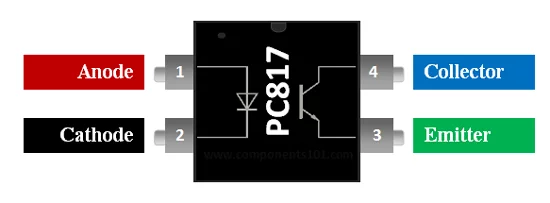
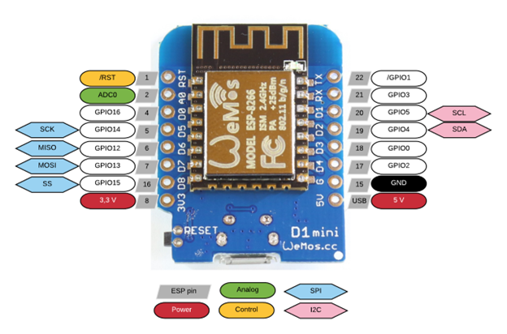

# Controller Hardware

## Features
- 3.3v Output Pins to Control Power Relays
- PC817 Optocoupler (Pull Up Low Trigger Relays if not operated)
- Water Level Sensor Not Connected

### Water Level Sensor Tutorial (if added later)
[Washing machine water level sensor programming](https://www.youtube.com/watch?v=qt3wwKuItsE)

## Components Used
- esp8266
- 3x Optocoupler
- 4x channel SSR Board
- 2x Fotek 40DA SSR
- 5V Power Supply

## GPIO pinouts

### PC817 Optocoupler Pinout

### Wemos D1 GPIO pinout

## IO Connections

- https://randomnerdtutorials.com/esp8266-pinout-reference-gpios/
- ESP8266 can be prevented from booting if some pins are pulled LOW or HIGH.

| Pin | Connection                                       |
|-----|--------------------------------------------------|
| D1  | CLOCKWISE_SPINNER_POWER_RELAY_OUTPUT_PIN         |
| D2  | ANTICLOCKWISE_SPINNER_POWER_RELAY_OUTPUT_PIN     |
| D3  |                                                  |
| D4  |                                                  |
| D5  | LID_INPUT_PIN                                    |
| D6  | WATER_DRAIN_VALVE_RELAY_OUTPUT_PIN               |
| D7  | HOT_WATER_INLET_VALVE_RELAY_OUTPUT_PIN           |
| D8  | COLD_WATER_INLET_VALVE_RELAY_OUTPUT_PIN          |
| A0  |                                                  |
