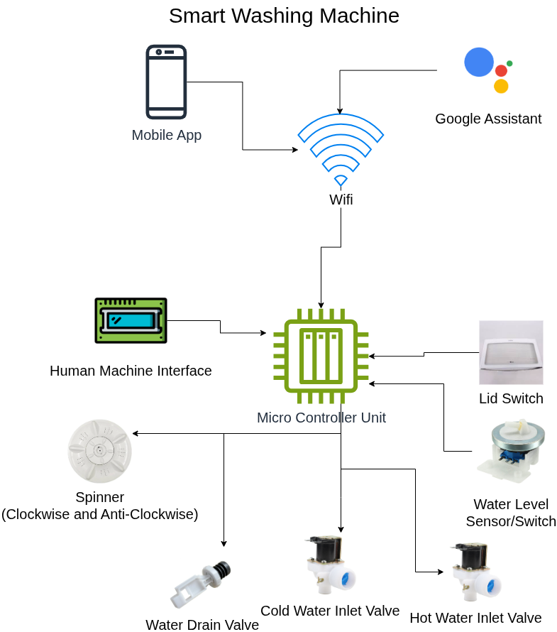
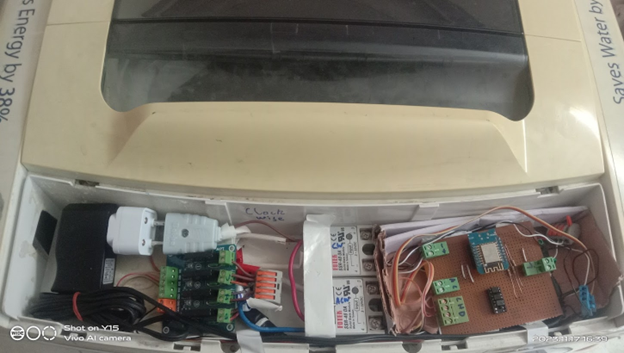

  <h1>smart_washing_machine</h1>
  
<h3 align="center">Design, Development, Operation, and Maintenance of a Smart Washing Machine with Android App Control. 🚀</h3>

[Android App](https://github.com/HuzaifaIrfan-Mobile/smart-washing-machine-app)
&nbsp;&nbsp;•&nbsp;&nbsp;
[Firmware](https://github.com/HuzaifaIrfan-Firmware/smart-washing-machine-esp8266)

Started on 9 November 2023

Updated on 23 November 2023

## Demo Video

[Demo Video](https://www.youtube.com/shorts/oTMUrj1S7qQ)

## Objective
- Repair Old Fully Automatic Washing Machine at Home

## Activities
- [x] Analyze Previous Washing Machine Circuit and Working
- [x] Define Project Requirements and Specifications
- [x] Develop Controller Firmware
- [x] Design Circuit Board
- [x] Develop Android App
- [ ] Connect the System with Google Assistant

## Schematics and PCB Design
https://oshwlab.com/huzaifairfan2001/smart-washing-machine

## Hardware Overview

- [Machine-Hardware](Machine-Hardware.md)
- [Controller-Hardware](Controller-Hardware.md)

## Overview

## Final

## Maintenance
- Replace faulty Hardware Parts
- See [CONTRIBUTING](CONTRIBUTING.md)

# 📝 Documentation

# 📚 References

# 🤝🏻 Connect with Me

# 📜 License

Licensed under the GPL3 License, Copyright 2025 Huzaifa Irfan. [LICENSE](LICENSE)
